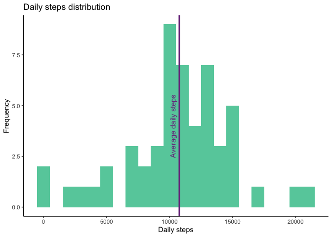
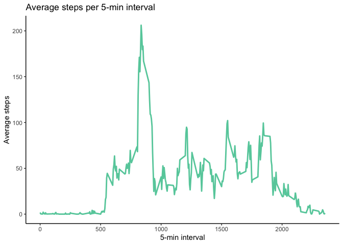
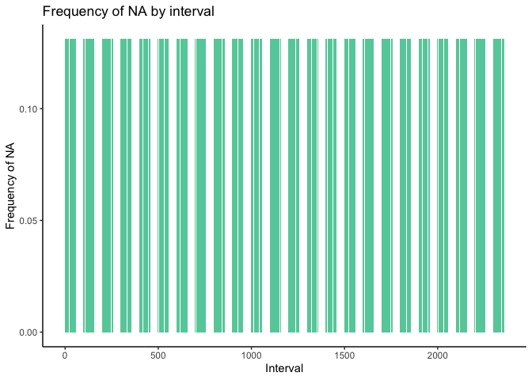
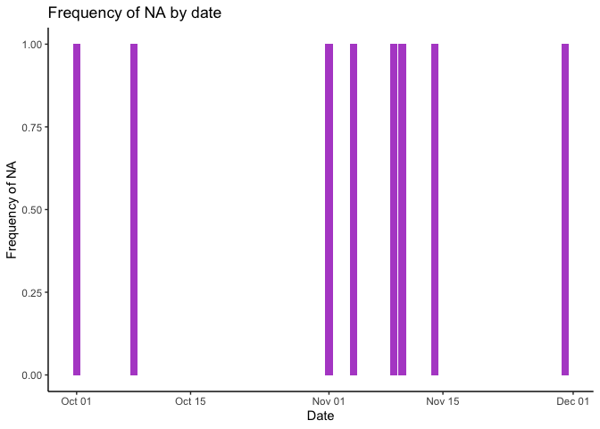
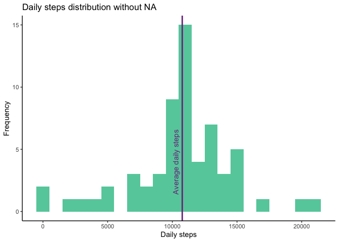
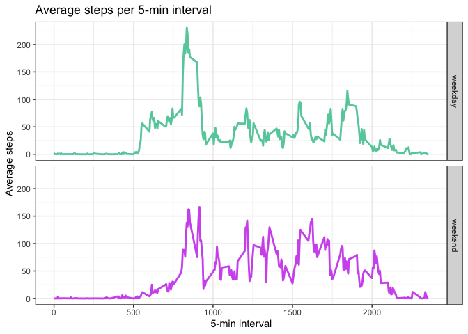

This assignment makes use of data from a personal activity monitoring device. This device collects data at 5 minute intervals through out the day. The data consists of two months of data from an anonymous individual collected during the months of October and November, 2012 and include the number of steps taken in 5 minute intervals each day.

## Loading and preprocessing the data


```r
library(tidyverse)
```

```
## ── Attaching packages ─────────────────────────────────────── tidyverse 1.3.2 ──
## ✔ ggplot2 3.4.1     ✔ purrr   1.0.1
## ✔ tibble  3.1.8     ✔ dplyr   1.1.0
## ✔ tidyr   1.3.0     ✔ stringr 1.5.0
## ✔ readr   2.1.3     ✔ forcats 1.0.0
## ── Conflicts ────────────────────────────────────────── tidyverse_conflicts() ──
## ✖ dplyr::filter() masks stats::filter()
## ✖ dplyr::lag()    masks stats::lag()
```


```r
activity <- read_csv("activity.csv")
```

```
## Rows: 17568 Columns: 3
## ── Column specification ────────────────────────────────────────────────────────
## Delimiter: ","
## dbl  (2): steps, interval
## date (1): date
## 
## ℹ Use `spec()` to retrieve the full column specification for this data.
## ℹ Specify the column types or set `show_col_types = FALSE` to quiet this message.
```

```r
str(activity, give.attr=FALSE)
```

```
## spc_tbl_ [17,568 × 3] (S3: spec_tbl_df/tbl_df/tbl/data.frame)
##  $ steps   : num [1:17568] NA NA NA NA NA NA NA NA NA NA ...
##  $ date    : Date[1:17568], format: "2012-10-01" "2012-10-01" ...
##  $ interval: num [1:17568] 0 5 10 15 20 25 30 35 40 45 ...
```

## What is mean total number of steps taken per day?
1. Calculate the total number of steps taken per day

2. Make a histogram of the total number of steps taken each day

3. Calculate and report the mean and median of the total number of steps taken per day


```r
steps_day <- aggregate(.~date, activity[,1:2], sum)

ggplot(steps_day, aes(steps)) +
    geom_histogram(fill="aquamarine3", binwidth=1000) +
    theme_classic() +
    labs(x="Daily steps", y="Frequency", title="Daily steps distribution") +
    geom_vline(xintercept = mean(steps_day$steps), color="mediumorchid4", linewidth=1) +
    
    annotate("text", x=mean(steps_day$steps)-500, y=4, label="Average daily steps", angle=90, color="mediumorchid4")
```

<!-- -->

```r
summary(steps_day$steps)
```

```
##    Min. 1st Qu.  Median    Mean 3rd Qu.    Max. 
##      41    8841   10765   10766   13294   21194
```

## What is the average daily activity pattern?

1. Make a time series plot (i.e. type = "l") of the 5-minute interval (x-axis) and the average number of steps taken, averaged across all days (y-axis)


```r
steps_interval <- group_by(activity, interval) %>% summarise(steps_mean=mean(steps, na.rm=TRUE))

ggplot(steps_interval, aes(interval, steps_mean)) +
    geom_line(color="aquamarine3", linewidth=1) +
    theme_classic() +
    labs(x="5-min interval", y="Average steps", title="Average steps per 5-min interval")
```

<!-- -->

2. Which 5-minute interval, on average across all the days in the dataset, contains the maximum number of steps?


```r
filter(steps_interval, steps_mean==max(steps_interval$steps_mean))
```

```
## # A tibble: 1 × 2
##   interval steps_mean
##      <dbl>      <dbl>
## 1      835       206.
```

## Imputing missing values
Note that there are a number of days/intervals where there are missing values (coded as 
NA). The presence of missing days may introduce bias into some calculations or summaries of the data.

1. Calculate and report the total number of missing values in the dataset (i.e. the total number of rows with NAs)


```r
complete <- table(complete.cases(activity))
complete
```

```
## 
## FALSE  TRUE 
##  2304 15264
```
The dataset contains 2304 incomplete cases.

2. Devise a strategy for filling in all of the missing values in the dataset. The strategy does not need to be sophisticated. For example, you could use the mean/median for that day, or the mean for that 5-minute interval, etc.

Checking how the incomplete cases are distributed across 5-minute intervals or days.

```r
activity2 <- group_by(activity, interval) %>% summarise(na_freq=mean(is.na(steps)))

activity3 <- group_by(activity, date) %>% summarise(na_freq=mean(is.na(steps)))

ggplot(activity2, aes(interval, na_freq)) +
    geom_bar(stat="identity", fill="aquamarine3") +
    theme_classic() +
    labs(x="Interval", y="Frequency of NA", title="Frequency of NA by interval")
```

<!-- -->

```r
ggplot(activity3, aes(date, na_freq)) +
    geom_bar(stat="identity", fill="mediumorchid3") +
    theme_classic() +
    labs(x="Date", y="Frequency of NA", title="Frequency of NA by date")
```

<!-- -->

The NA values are concentrated in specific days (when 100% of the data are missing), while they are homogeneously distributed across time intervals. I will then fill in the incomplete cases with the mean value for that time interval measured on other days (from the previously created **steps_interval** dataset).

3. Create a new dataset that is equal to the original dataset but with the missing data filled in.


```r
activity_imp <- activity

activity_imp <- merge(activity, steps_interval, by = "interval")

activity_imp[is.na(activity_imp$steps), 2] <- activity_imp[is.na(activity_imp$steps), 4]

activity_imp <- activity_imp[,1:3]

head(arrange(activity_imp, date))
```

```
##   interval     steps       date
## 1        0 1.7169811 2012-10-01
## 2        5 0.3396226 2012-10-01
## 3       10 0.1320755 2012-10-01
## 4       15 0.1509434 2012-10-01
## 5       20 0.0754717 2012-10-01
## 6       25 2.0943396 2012-10-01
```

```r
table(complete.cases(activity_imp))
```

```
## 
##  TRUE 
## 17568
```

Now all cases are complete.

4. Make a histogram of the total number of steps taken each day and Calculate and report the mean and median total number of steps taken per day. Do these values differ from the estimates from the first part of the assignment? What is the impact of imputing missing data on the estimates of the total daily number of steps?


```r
steps_day_new <- aggregate(.~date, activity_imp[,2:3], sum)

ggplot(steps_day_new, aes(steps)) +
    geom_histogram(fill="aquamarine3", binwidth=1000) +
    theme_classic() +
    labs(x="Daily steps", y="Frequency", title="Daily steps distribution without NA") +
    geom_vline(xintercept = mean(steps_day$steps), color="mediumorchid4", linewidth=1) +
    
    annotate("text", x=mean(steps_day$steps)-500, y=4, label="Average daily steps", angle=90, color="mediumorchid4")
```

<!-- -->

```r
summary(steps_day_new$steps)
```

```
##    Min. 1st Qu.  Median    Mean 3rd Qu.    Max. 
##      41    9819   10766   10766   12811   21194
```

The distribution is quite similar to the one obtained prior to NA removal, but frequencies are higher due to increased amount of non-NA values.

## Are there differences in activity patterns between weekdays and weekends?
For this part the weekdays() function may be of some help here. Use the dataset with the filled-in missing values for this part.

1. Create a new factor variable in the dataset with two levels – “weekday” and “weekend” indicating whether a given date is a weekday or weekend day.


```r
activity_imp$day <- weekdays(activity_imp$date) %>% recode(
    "Monday"="weekday",
    "Tuesday"="weekday",
    "Wednesday"="weekday",
    "Thursday"="weekday",
    "Friday"="weekday",
    "Saturday"="weekend",
    "Sunday"="weekend")

activity_imp$day <- as.factor(activity_imp$day)

table(activity_imp$day)
```

```
## 
## weekday weekend 
##   12960    4608
```

```r
str(activity_imp)
```

```
## 'data.frame':	17568 obs. of  4 variables:
##  $ interval: num  0 0 0 0 0 0 0 0 0 0 ...
##  $ steps   : num  1.72 0 0 0 0 ...
##  $ date    : Date, format: "2012-10-01" "2012-11-23" ...
##  $ day     : Factor w/ 2 levels "weekday","weekend": 1 1 2 1 2 1 2 1 1 2 ...
```

2. Make a panel plot containing a time series plot (i.e. type = "l") of the 5-minute interval (x-axis) and the average number of steps taken, averaged across all weekday days or weekend days (y-axis). See the README file in the GitHub repository to see an example of what this plot should look like using simulated data.


```r
activity_week <- activity_imp %>% group_by(day, interval) %>% summarise(steps_mean=mean(steps))
```

```
## `summarise()` has grouped output by 'day'. You can override using the `.groups`
## argument.
```

```r
ggplot(activity_week, aes(interval, steps_mean, color=day)) + 
    geom_line(linewidth=1, show.legend = F) + 
    facet_grid(day~.) +
    theme_bw() +
    scale_color_manual(values=c("aquamarine3", "mediumorchid2")) + 
    labs(x="5-min interval", y="Average steps", title="Average steps per 5-min interval")
```

<!-- -->


